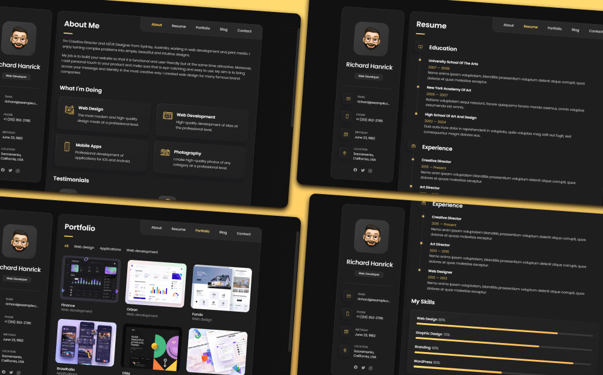

<a name="readme-top"></a>



<p align="center">
  
  
  
  
</p>

<p align="center">
  <strong>
    <a href="#-summary">👀 Summary</a>&nbsp;&nbsp;&bull;&nbsp;
    <a href="#-features">✨ Feature</a>&nbsp;&nbsp;&bull;&nbsp;
    <a href="#-contributing">🌏 Contributing</a>&nbsp;&nbsp;&bull;&nbsp;
    <a href="#-contact-info">📲 Contact Info</a>&nbsp;&nbsp;&bull;&nbsp;
    <a href="#-license">🪪 License</a>&nbsp;&nbsp;&bull;&nbsp;
    <a href="#">📚 Docs</a>
  </strong>
</p>

## 👀 Summary

##### Hi there, 👋

My name is Thomas, currently a fullstack developer.<br/>
This project is my personal portfolio and blog, built to showcase my skills, projects, and thoughts. It's designed to be easily maintainable by updating content and configurations.

## ✨ Features

- 💀 [Skeleton Loading]
- ⚡️ [Next.js 15 with App Router]
- ✍🏻 [Markdown Rendering]
- 🧪 [Jest - Components Unit Testing]
- 🟩 [GitHub Calendar Heatmap]
- 💎 [giscus]
- 🚨 [GitHub Alerts]

[Skeleton Loading]: https://github.com/dvtng/react-loading-skeleton
[Next.js 15 with App Router]: https://nextjs.org/
[Markdown Rendering]: https://github.com/hashicorp/next-mdx-remote
[Jest - Components Unit Testing]: https://jestjs.io/
[GitHub Calendar Heatmap]: https://github.com/grubersjoe/react-github-calendar
[giscus]: https://giscus.app/
[GitHub Alerts]: https://github.com/chrisweb/rehype-github-alerts

## 🌏 Contributing

[PRs](https://github.com/hoatepdev/portfolio/pulls) and [Issues](https://github.com/hoatepdev/portfolio/issues) are welcome! 🫵🏻

Please read the [Contributing Guideline] for details on our code of conduct, and the process for submitting pull requests to us.

[Contributing Guideline]: CONTRIBUTING.md

## 🔩 Getting Started

> [!NOTE]
> We choose [`pnpm`](https://pnpm.io/) as our package manager. Make sure you have it installed before running the following commands.

```shell
$ git clone git@github.com:hoatepdev/portfolio.git
$ cd portfolio
$ pnpm install
```

### Run the Web App

```shell
$ cd apps/web
$ pnpm run dev   # Open http://localhost:3100 with your browser to see the result.
```

### Run the Docs

```shell
$ cd apps/docs
$ pnpm run dev   # Open http://localhost:3001 with your browser to see the result.
```

## 📲 Contact

> **Hoà T.(Thomas) Nguyễn**
>
> <aside>
>   📩 E-mail: <a href="mailto:hoanguyentrandev@gmail.com">hoanguyentrandev@gmail.com</a>
> <br>
>   🧳 Linkedin: <a href="https://www.linkedin.com/in/hoatepdev/">Hoà T.Nguyễn</a>
> <br>
>   👨🏻‍💻 GitHub: <a href="https://github.com/hoatepdev">hoatepdev</a>
> </aside>

## 🪪 License

> This work is licensed under a [Creative Commons Attribution 4.0 International License][cc-by].
>
> [cc-by]: http://creativecommons.org/licenses/by/4.0/

Inspired by the 👑 [@1chooo](https://x.com/1chooo___).
I really appreciate the author's work on this template. It's been an invaluable resource and inspiration for my development. 🍀

<p align="right" style="font-size: 14px; color: #555; margin-top: 20px;">
    <a href="#readme-top" style="text-decoration: none; color: #007bff; font-weight: bold;">
        ↑ Back to Top ↑
    </a>
</p>
